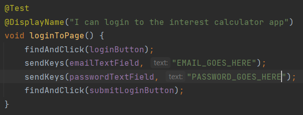

## Ten10 Technical Test - Interest Calculator App

This is my submission for the technical assessment part of Ten10's interview process

### Pre-requisites
 - I have only included the ChromeDriver setup, so you will need the latest version of [Google Chrome](https://www.google.com/intl/en_uk/chrome/dr/download/)
 - This is a Gradle Project, so you may need to import the Gradle Project before attempting to run the tests
 - You will need to input your username and password into the relevant fields in the loginToPage test, or comment the BeforeEach in the test class before running
   - 

### Tests

 - [x] The application should provide options to choose the duration for interest calculation: Daily, Monthly, and Yearly.
 - [x] Users should be able to input the principal amount.
 - [x] Users should be able to select the interest rate from a predefined list of rates up to 15%.
 - [x] The application should calculate the correct interest based on the selected duration, principal amount, and interest rate.
 - [x] The application should display the calculated interest and the total amount including interest.
 - [x] All input fields (principal amount, interest rate, duration and consent) are mandatory.
 - [x] The application should inform the user if any field is left empty or not selected.

For simplicity, the calculated interest and total amount should be rounded to two decimal places.
The application should be responsive and user-friendly.
Clear error messages should be displayed to guide users in case of missing or incorrect inputs.